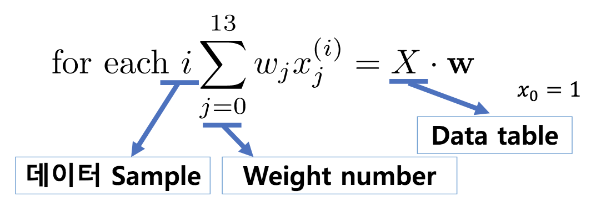

Chapter 4<br/>
< Representing a model >
===============================


### 백터를 Array로 표현하기
- Wᵀ𝐱

```
    [ w₀]              [   1   ]
    [ w₁]              [0.00632]
w = [ w₂]       𝟀⁽¹⁾ = [  18   ]
    [ w₃]              [  2.31 ]
    [...]              [ 0.538 ]
    [w₁₃]              [  ...  ]
                       [  24   ]
```


### Pandas + Numpy

