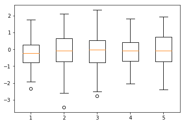

Chapter 5<br/>
< Visualization - matplotlib >
===============================

[[실행 코드]](https://github.com/alstn2468/Python_For_Machine_Learning/blob/master/Chapter.5/4.ipynb)


### Visualization - 데이터 시각화
- 파이썬의 대표적인 시각화 도구 : matplotlib
- 다양한 graph 지원, Pandas 연동


### matplotlib
- pyplot 객체를 사용하여 데이터를 표시
- pyplot 객체에 그래프들을 쌓은 다음 show로 flush


```python
import matplotlib.pyplot as plt

X = range(100)
Y = [value ** 2 for value in X]
plt.plot(X, Y)
plt.show()
```


    <matplotlib.figure.Figure at 0x108bbd128>


- 최대 단점 : argument를 kwargs를 받는다.
- 고정된 argument가 없어서 alt + tab으로 확인이 어렵다.
- 그래프는 figure 객체에 생성
- pyplot 객체 사용시, 기본 figure에 그래프가 그려진다.


```python
import numpy as np

X_1 = range(100)
Y_1 = [np.cos(value) for value in X]

X_2 = range(100)
Y_2 = [np.sin(value) for value in X]

plt.plot(X_1, Y_1)
plt.plot(X_2, Y_2)
plt.show()
```


```python
fig = plt.figure()
fig.set_size_inches(10, 10)

ax_1 = fig.add_subplot(1, 2, 1)
ax_2 = fig.add_subplot(1, 2, 2)

ax_1.plot(X_1, Y_1, c = "b")
ax_2.plot(X_2, Y_2, c = "g")
plt.show()
```


### Set color
- color 속성을 사용
- Float : 흑백
- rgb color, predefined color 사용


```python
X_1 = range(100)
Y_1 = [value for value in X]

X_2 = range(100)
Y_2 = [value + 100 for value in X]

plt.plot(X_1, Y_1, color = '#eeefff')
plt.plot(X_2, Y_2, color = 'r')

plt.show()
```


### Set linestyle
- ls 또는 linestyle 속성 사용


```python
plt.plot(X_1, Y_1, c = "b", linestyle = "dashed")
plt.plot(X_2, Y_2, c = "r", ls = "dotted")

plt.show()
```


### Set title
- pyplot에 title함수 사용
- figure의 subplot별 입력 가능


```python
plt.plot(X_1, Y_1, color = "b", linestyle = "dashed")
plt.plot(X_2, Y_2, color = "r", linestyle = "dotted")

plt.title("Two lines")
plt.show()
```


- Latex 타입의 표현도 가능(수식도 가능)


```python
plt.plot(X_1, Y_1, color = "b", linestyle = "dashed")
plt.plot(X_2, Y_2, color = "r", linestyle = "dotted")

plt.title('$y = \\frac{ax + b}{test}$')
plt.show()
```


### Set legend
- legend함수로 범례를 표시
- loc 위치등 속성 지정


```python
plt.plot(X_1, Y_1, color = "b", linestyle = "dashed", label = 'line_1')
plt.plot(X_2, Y_2, color = "r", linestyle = "dotted", label = 'line_2')
plt.legend(shadow = True, fancybox = True, loc = "lower right")

plt.title('$y = ax+b$')
plt.xlabel('$x_line$')
plt.ylabel('y_line')

plt.show()
```


### Set grid & xylim
- Graph 보조선을 긋는 Grid
- xy축 범위 한계를 지정하는 xylim


```python
plt.plot(X_1, Y_1, color = "b", linestyle = "dashed", label = 'line_1')
plt.plot(X_2, Y_2, color = "r", linestyle = "dotted", label = 'line_2')
plt.legend(shadow = True, fancybox = True, loc = "lower right")


plt.grid(True, lw = 0.4, ls = "--", c = ".90")
plt.xlim(-100, 200)
plt.ylim(-100, 200)

plt.show()
```


### Scatter
- scatter함수 사용, marker : scatter 모양 지정


```python
data_1 = np.random.rand(512, 2)
data_2 = np.random.rand(512, 2)

plt.scatter(data_1[:,0], data_1[:,1], c = "b", marker = "x")
plt.scatter(data_2[:,0], data_2[:,1], c = "r", marker = "o")

plt.show()
```


- s : 데이터의 크기 지정, 데이터 크기 비교 가능


```python
N = 50
x = np.random.rand(N)
y = np.random.rand(N)
colors = np.random.rand(N)
area = np.pi * (15 * np.random.rand(N)) ** 2 
plt.scatter(x, y, s = area, c = colors, alpha = 0.5)
plt.show()
```


### Bar chart
- Bar함수 사용


```python
data = [[5., 25., 50., 20.],
        [4., 23., 51., 17],
        [6., 22., 52., 19]]

X = np.arange(4)
plt.bar(X + 0.00, data[0], color = 'b', width = 0.25)
plt.bar(X + 0.25, data[1], color = 'g', width = 0.25)
plt.bar(X + 0.50, data[2], color = 'r', width = 0.25)
plt.xticks(X + 0.25, ("A", "B", "C", "D"))
plt.show()
```


```python
data = np.array([[5., 5., 5., 5.],
                 [4., 23., 51., 17],
                 [6., 22., 52., 19]])

color_list = ['b', 'g', 'r']
data_label = ["A", "B", "C"]
X = np.arange(data.shape[1])

for i in range(data.shape[0]) :
    plt.bar(X, data[i], bottom = np.sum(data[:i], axis = 0),
            color = color_list[i], label = data_label[i])
    
plt.legend()
plt.show()
```


### histogram


```python
X = np.random.randn(1000)
plt.hist(X, bins = 100)
plt.show()
```


### boxplot


```python
data = np.random.randn(100, 5)
plt.boxplot(data)
plt.show()
```





### pandas matplotlib
- pandas 0.7 버전이상 부터 matplotlib를 사용한 그래프 지원
- Dataframe, Series별 그래프 작성 가능


```python
import pandas as pd
import matplotlib.pyplot as plt
import numpy as np

data_url = './data/housing.data'
df_data = pd.read_csv(data_url, sep = '\s+', header = None)
df_data.columns = ['CRIM','ZN', 'INDUS', 'CHAS', 'NOX',
                   'RM', 'AGE', 'DIS', 'RAD', 'TAX',
                   'PTRATIO' ,'B', 'LSTAT', 'MEDV'] 
df_data.head()
```


<div>
<style>
    .dataframe thead tr:only-child th {
        text-align: right;
    }

    .dataframe thead th {
        text-align: left;
    }

    .dataframe tbody tr th {
        vertical-align: top;
    }
</style>
<table border="1" class="dataframe">
  <thead>
    <tr style="text-align: right;">
      <th></th>
      <th>CRIM</th>
      <th>ZN</th>
      <th>INDUS</th>
      <th>CHAS</th>
      <th>NOX</th>
      <th>RM</th>
      <th>AGE</th>
      <th>DIS</th>
      <th>RAD</th>
      <th>TAX</th>
      <th>PTRATIO</th>
      <th>B</th>
      <th>LSTAT</th>
      <th>MEDV</th>
    </tr>
  </thead>
  <tbody>
    <tr>
      <th>0</th>
      <td>0.00632</td>
      <td>18.0</td>
      <td>2.31</td>
      <td>0</td>
      <td>0.538</td>
      <td>6.575</td>
      <td>65.2</td>
      <td>4.0900</td>
      <td>1</td>
      <td>296.0</td>
      <td>15.3</td>
      <td>396.90</td>
      <td>4.98</td>
      <td>24.0</td>
    </tr>
    <tr>
      <th>1</th>
      <td>0.02731</td>
      <td>0.0</td>
      <td>7.07</td>
      <td>0</td>
      <td>0.469</td>
      <td>6.421</td>
      <td>78.9</td>
      <td>4.9671</td>
      <td>2</td>
      <td>242.0</td>
      <td>17.8</td>
      <td>396.90</td>
      <td>9.14</td>
      <td>21.6</td>
    </tr>
    <tr>
      <th>2</th>
      <td>0.02729</td>
      <td>0.0</td>
      <td>7.07</td>
      <td>0</td>
      <td>0.469</td>
      <td>7.185</td>
      <td>61.1</td>
      <td>4.9671</td>
      <td>2</td>
      <td>242.0</td>
      <td>17.8</td>
      <td>392.83</td>
      <td>4.03</td>
      <td>34.7</td>
    </tr>
    <tr>
      <th>3</th>
      <td>0.03237</td>
      <td>0.0</td>
      <td>2.18</td>
      <td>0</td>
      <td>0.458</td>
      <td>6.998</td>
      <td>45.8</td>
      <td>6.0622</td>
      <td>3</td>
      <td>222.0</td>
      <td>18.7</td>
      <td>394.63</td>
      <td>2.94</td>
      <td>33.4</td>
    </tr>
    <tr>
      <th>4</th>
      <td>0.06905</td>
      <td>0.0</td>
      <td>2.18</td>
      <td>0</td>
      <td>0.458</td>
      <td>7.147</td>
      <td>54.2</td>
      <td>6.0622</td>
      <td>3</td>
      <td>222.0</td>
      <td>18.7</td>
      <td>396.90</td>
      <td>5.33</td>
      <td>36.2</td>
    </tr>
  </tbody>
</table>
</div>


### 데이터간의 상관관계
- scatter graph 사용 가능


```python
fig = plt.figure()
ax = []
for i in range(1, 5) :
    ax.append(fig.add_subplot(2, 2, i))
    
ax[0].scatter(df_data["CRIM"], df_data["MEDV"])
ax[1].scatter(df_data["PTRATIO"], df_data["MEDV"])
ax[2].scatter(df_data["AGE"], df_data["MEDV"])
ax[3].scatter(df_data["NOX"], df_data["MEDV"])
plt.show()
```


- matplotlib의 꾸미기 함수 그대로 사용


```python
fig = plt.figure()
fig.set_size_inches(10.0, 10.0, forward = True)
ax = []
for i in range(1, 5) :
    ax.append(fig.add_subplot(2, 2, i))

columns = ["CRIM", "PTRATIO", "AGE", "NOX"]
colors = ["b", "g", "c", "r"]

for i in range(4) :
    ax[i].scatter(df_data[columns[i]], df_data["MEDV"], color = colors[i], label = columns[i])
    ax[i].legend()
    ax[i].set_title(columns[i])

plt.subplots_adjust(wspace = 0, hspace = 0)
plt.show()
```


- plot함수를 사용하면 전체 데이터의 graph를 그린다.


```python
df_data.plot()
plt.show()
```


```python
fig = plt.figure()
fig.set_size_inches(5, 5)
ax_1 = fig.add_subplot(1, 2, 1)
ax_2 = fig.add_subplot(1, 2, 2)
ax_1.plot(df_data["MEDV"])
ax_2.hist(df_data["MEDV"], bins = 50)
ax_1.set_title("House price MEDV")
ax_2.set_title("House price MEDV")

plt.show()
```


```python
from sklearn.preprocessing import StandardScaler

std_scaler = StandardScaler()
scale_data = std_scaler.fit_transform(df_data)
fig = plt.figure()
ax = fig.add_subplot(1, 1, 1)
ax.boxplot(scale_data, labels = df_data.columns)
fig.set_size_inches(18.5, 10.5)
plt.show()
```


### Scatter Matrix


```python
pd.scatter_matrix(df_data, diagonal = "kde", alpha = 1,  figsize = (20, 20))
plt.show()
```

    /anaconda3/lib/python3.6/site-packages/ipykernel_launcher.py:1: FutureWarning: pandas.scatter_matrix is deprecated. Use pandas.plotting.scatter_matrix instead
      """Entry point for launching an IPython kernel.


```python
corr_data = np.corrcoef(scale_data.T[:14])

fig = plt.figure()
ax = fig.add_subplot(111)
cax = ax.matshow(corr_data, vmin = -1, vmax = 1,  interpolation = 'nearest')
fig.colorbar(cax)
fig.set_size_inches(10, 10)
ticks= np.arange(0, 14, 1)
ax.set_xticks(ticks)
ax.set_yticks(ticks)

ax.set_xticklabels(df_data.columns[:5])
ax.set_yticklabels(df_data.columns[:5])

plt.show()
```


