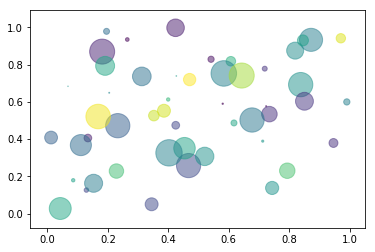

Chapter 5<br/>
< Visualization - matplotlib >
===============================

[[실행 코드]](https://github.com/alstn2468/Python_For_Machine_Learning/blob/master/Chapter.5/4.ipynb)


### Visualization - 데이터 시각화
- 파이썬의 대표적인 시각화 도구 : matplotlib
- 다양한 graph 지원, Pandas 연동


### matplotlib
- pyplot 객체를 사용하여 데이터를 표시
- pyplot 객체에 그래프들을 쌓은 다음 show로 flush


```python
import matplotlib.pyplot as plt

X = range(100)
Y = [value ** 2 for value in X]
plt.plot(X, Y)
plt.show()
```


    <matplotlib.figure.Figure at 0x1126d3160>


- 최대 단점 : argument를 kwargs를 받는다.
- 고정된 argument가 없어서 alt + tab으로 확인이 어렵다.
- 그래프는 figure 객체에 생성
- pyplot 객체 사용시, 기본 figure에 그래프가 그려진다.


```python
import numpy as np

X_1 = range(100)
Y_1 = [np.cos(value) for value in X]

X_2 = range(100)
Y_2 = [np.sin(value) for value in X]

plt.plot(X_1, Y_1)
plt.plot(X_2, Y_2)
plt.show()
```


```python
fig = plt.figure()
fig.set_size_inches(10, 10)

ax_1 = fig.add_subplot(1, 2, 1)
ax_2 = fig.add_subplot(1, 2, 2)

ax_1.plot(X_1, Y_1, c = "b")
ax_2.plot(X_2, Y_2, c = "g")
plt.show()
```


### Set color
- color 속성을 사용
- Float : 흑백
- rgb color, predefined color 사용


```python
X_1 = range(100)
Y_1 = [value for value in X]

X_2 = range(100)
Y_2 = [value + 100 for value in X]

plt.plot(X_1, Y_1, color = '#eeefff')
plt.plot(X_2, Y_2, color = 'r')

plt.show()
```


### Set linestyle
- ls 또는 linestyle 속성 사용


```python
plt.plot(X_1, Y_1, c = "b", linestyle = "dashed")
plt.plot(X_2, Y_2, c = "r", ls = "dotted")

plt.show()
```


### Set title
- pyplot에 title함수 사용
- figure의 subplot별 입력 가능


```python
plt.plot(X_1, Y_1, color = "b", linestyle = "dashed")
plt.plot(X_2, Y_2, color = "r", linestyle = "dotted")

plt.title("Two lines")
plt.show()
```


- Latex 타입의 표현도 가능(수식도 가능)


```python
plt.plot(X_1, Y_1, color = "b", linestyle = "dashed")
plt.plot(X_2, Y_2, color = "r", linestyle = "dotted")

plt.title('$y = \\frac{ax + b}{test}$')
plt.show()
```


### Set legend
- legend함수로 범례를 표시
- loc 위치등 속성 지정


```python
plt.plot(X_1, Y_1, color = "b", linestyle = "dashed", label = 'line_1')
plt.plot(X_2, Y_2, color = "r", linestyle = "dotted", label = 'line_2')
plt.legend(shadow = True, fancybox = True, loc = "lower right")

plt.title('$y = ax+b$')
plt.xlabel('$x_line$')
plt.ylabel('y_line')

plt.show()
```


### Set grid & xylim
- Graph 보조선을 긋는 Grid
- xy축 범위 한계를 지정하는 xylim


```python
plt.plot(X_1, Y_1, color = "b", linestyle = "dashed", label = 'line_1')
plt.plot(X_2, Y_2, color = "r", linestyle = "dotted", label = 'line_2')
plt.legend(shadow = True, fancybox = True, loc = "lower right")


plt.grid(True, lw = 0.4, ls = "--", c = ".90")
plt.xlim(-100, 200)
plt.ylim(-100, 200)

plt.show()
```


### Scatter
- scatter함수 사용, marker : scatter 모양 지정


```python
data_1 = np.random.rand(512, 2)
data_2 = np.random.rand(512, 2)

plt.scatter(data_1[:,0], data_1[:,1], c = "b", marker = "x")
plt.scatter(data_2[:,0], data_2[:,1], c = "r", marker = "o")

plt.show()
```


- s : 데이터의 크기 지정, 데이터 크기 비교 가능


```python
N = 50
x = np.random.rand(N)
y = np.random.rand(N)
colors = np.random.rand(N)
area = np.pi * (15 * np.random.rand(N)) ** 2 
plt.scatter(x, y, s = area, c = colors, alpha = 0.5)
plt.show()
```





### Bar chart
- Bar함수 사용


```python
data = [[5., 25., 50., 20.],
        [4., 23., 51., 17],
        [6., 22., 52., 19]]

X = np.arange(4)
plt.bar(X + 0.00, data[0], color = 'b', width = 0.25)
plt.bar(X + 0.25, data[1], color = 'g', width = 0.25)
plt.bar(X + 0.50, data[2], color = 'r', width = 0.25)
plt.xticks(X + 0.25, ("A", "B", "C", "D"))
plt.show()
```


```python
data = np.array([[5., 5., 5., 5.],
                 [4., 23., 51., 17],
                 [6., 22., 52., 19]])

color_list = ['b', 'g', 'r']
data_label = ["A", "B", "C"]
X = np.arange(data.shape[1])

for i in range(data.shape[0]) :
    plt.bar(X, data[i], bottom = np.sum(data[:i], axis = 0),
            color = color_list[i], label = data_label[i])
    
plt.legend()
plt.show()
```


### histogram


```python
X = np.random.randn(1000)
plt.hist(X, bins = 100)
plt.show()
```


### boxplot


```python
data = np.random.randn(100, 5)
plt.boxplot(data)
plt.show()
```


