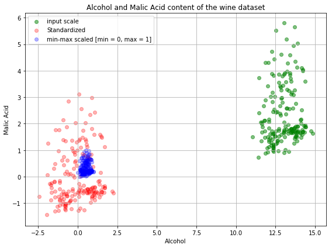
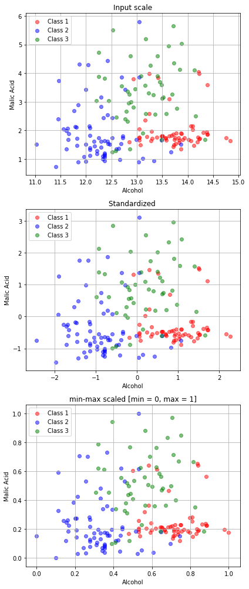

Chapter 5<br/>
< Data Cleansing >
===============================

[[실행 코드]](https://github.com/alstn2468/Python_For_Machine_Learning/blob/master/Chapter.5/5.ipynb)


### Data quality problems
- 데이터의 최대/최소가 다르다. -> Scale에 따른 y값에 영향
- Ordinary 또는 Normal한 값들의 표현
- 잘못 기입된 값들에 대한 처리
- 값이 없을 경우
- 극단적으로 큰 값 또는 작은 값에 대한 처리


### Data preprocessing issues
- 데이터가 빠진 경우
- 라벨링된 데이터의 데이터 처리
- 데이터의 scale의 차이가 매우 크게 날 경우


### 데이터가 존재하지 않을 때 할 수 있는 전략
- 데이터가 없으면 sample을 drop
- 데이터가 없는 최소 개수를 정해서 sample을 drop
- 데이터가 거의 없는 feature는 feature 자체를 drop
- 최빈값, 평균값으로 비어있는 데이터 채우기


```python
import pandas as pd
import numpy as np

raw_data = {'first_name': ['Jason', np.nan, 'Tina', 'Jake', 'Amy'],
            'last_name': ['Miller', np.nan, 'Ali', 'Milner', 'Cooze'],
            'age': [42, np.nan, 36, 24, 73],
            'sex': ['m', np.nan, 'f', 'm', 'f'],
            'preTestScore': [4, np.nan, np.nan, 2, 3],
            'postTestScore': [25, np.nan, np.nan, 62, 70]}

df = pd.DataFrame(raw_data, columns = ['first_name', 'last_name', 'age',
                                       'sex', 'preTestScore', 'postTestScore'])
df
```


<div>

<table border="1" class="dataframe">
  <thead>
    <tr style="text-align: right;">
      <th></th>
      <th>first_name</th>
      <th>last_name</th>
      <th>age</th>
      <th>sex</th>
      <th>preTestScore</th>
      <th>postTestScore</th>
    </tr>
  </thead>
  <tbody>
    <tr>
      <th>0</th>
      <td>Jason</td>
      <td>Miller</td>
      <td>42.0</td>
      <td>m</td>
      <td>4.0</td>
      <td>25.0</td>
    </tr>
    <tr>
      <th>1</th>
      <td>NaN</td>
      <td>NaN</td>
      <td>NaN</td>
      <td>NaN</td>
      <td>NaN</td>
      <td>NaN</td>
    </tr>
    <tr>
      <th>2</th>
      <td>Tina</td>
      <td>Ali</td>
      <td>36.0</td>
      <td>f</td>
      <td>NaN</td>
      <td>NaN</td>
    </tr>
    <tr>
      <th>3</th>
      <td>Jake</td>
      <td>Milner</td>
      <td>24.0</td>
      <td>m</td>
      <td>2.0</td>
      <td>62.0</td>
    </tr>
    <tr>
      <th>4</th>
      <td>Amy</td>
      <td>Cooze</td>
      <td>73.0</td>
      <td>f</td>
      <td>3.0</td>
      <td>70.0</td>
    </tr>
  </tbody>
</table>
</div>


### Data drop
- NaN인 데이터를 column별로 합계


```python
df.isnull().sum()
```


    first_name       1
    last_name        1
    age              1
    sex              1
    preTestScore     2
    postTestScore    2
    dtype: int64


- dropnan : 데이터들이 사라짐


```python
df_no_missing = df.dropna()
df_no_missing
```


<div>

<table border="1" class="dataframe">
  <thead>
    <tr style="text-align: right;">
      <th></th>
      <th>first_name</th>
      <th>last_name</th>
      <th>age</th>
      <th>sex</th>
      <th>preTestScore</th>
      <th>postTestScore</th>
    </tr>
  </thead>
  <tbody>
    <tr>
      <th>0</th>
      <td>Jason</td>
      <td>Miller</td>
      <td>42.0</td>
      <td>m</td>
      <td>4.0</td>
      <td>25.0</td>
    </tr>
    <tr>
      <th>3</th>
      <td>Jake</td>
      <td>Milner</td>
      <td>24.0</td>
      <td>m</td>
      <td>2.0</td>
      <td>62.0</td>
    </tr>
    <tr>
      <th>4</th>
      <td>Amy</td>
      <td>Cooze</td>
      <td>73.0</td>
      <td>f</td>
      <td>3.0</td>
      <td>70.0</td>
    </tr>
  </tbody>
</table>
</div>


- 모든 데이터가 비어있으면 drop


```python
df_cleaned = df.dropna(how = 'all')
df_cleaned
```


<div>

<table border="1" class="dataframe">
  <thead>
    <tr style="text-align: right;">
      <th></th>
      <th>first_name</th>
      <th>last_name</th>
      <th>age</th>
      <th>sex</th>
      <th>preTestScore</th>
      <th>postTestScore</th>
    </tr>
  </thead>
  <tbody>
    <tr>
      <th>0</th>
      <td>Jason</td>
      <td>Miller</td>
      <td>42.0</td>
      <td>m</td>
      <td>4.0</td>
      <td>25.0</td>
    </tr>
    <tr>
      <th>2</th>
      <td>Tina</td>
      <td>Ali</td>
      <td>36.0</td>
      <td>f</td>
      <td>NaN</td>
      <td>NaN</td>
    </tr>
    <tr>
      <th>3</th>
      <td>Jake</td>
      <td>Milner</td>
      <td>24.0</td>
      <td>m</td>
      <td>2.0</td>
      <td>62.0</td>
    </tr>
    <tr>
      <th>4</th>
      <td>Amy</td>
      <td>Cooze</td>
      <td>73.0</td>
      <td>f</td>
      <td>3.0</td>
      <td>70.0</td>
    </tr>
  </tbody>
</table>
</div>


- Nan값만 들어있는 column 생성


```python
df['location'] = np.nan
df
```


<div>

<table border="1" class="dataframe">
  <thead>
    <tr style="text-align: right;">
      <th></th>
      <th>first_name</th>
      <th>last_name</th>
      <th>age</th>
      <th>sex</th>
      <th>preTestScore</th>
      <th>postTestScore</th>
      <th>location</th>
    </tr>
  </thead>
  <tbody>
    <tr>
      <th>0</th>
      <td>Jason</td>
      <td>Miller</td>
      <td>42.0</td>
      <td>m</td>
      <td>4.0</td>
      <td>25.0</td>
      <td>NaN</td>
    </tr>
    <tr>
      <th>1</th>
      <td>NaN</td>
      <td>NaN</td>
      <td>NaN</td>
      <td>NaN</td>
      <td>NaN</td>
      <td>NaN</td>
      <td>NaN</td>
    </tr>
    <tr>
      <th>2</th>
      <td>Tina</td>
      <td>Ali</td>
      <td>36.0</td>
      <td>f</td>
      <td>NaN</td>
      <td>NaN</td>
      <td>NaN</td>
    </tr>
    <tr>
      <th>3</th>
      <td>Jake</td>
      <td>Milner</td>
      <td>24.0</td>
      <td>m</td>
      <td>2.0</td>
      <td>62.0</td>
      <td>NaN</td>
    </tr>
    <tr>
      <th>4</th>
      <td>Amy</td>
      <td>Cooze</td>
      <td>73.0</td>
      <td>f</td>
      <td>3.0</td>
      <td>70.0</td>
      <td>NaN</td>
    </tr>
  </tbody>
</table>
</div>


- column을 기준으로 삭제


```python
df.dropna(axis = 1, how = 'all')
```


<div>

<table border="1" class="dataframe">
  <thead>
    <tr style="text-align: right;">
      <th></th>
      <th>first_name</th>
      <th>last_name</th>
      <th>age</th>
      <th>sex</th>
      <th>preTestScore</th>
      <th>postTestScore</th>
    </tr>
  </thead>
  <tbody>
    <tr>
      <th>0</th>
      <td>Jason</td>
      <td>Miller</td>
      <td>42.0</td>
      <td>m</td>
      <td>4.0</td>
      <td>25.0</td>
    </tr>
    <tr>
      <th>1</th>
      <td>NaN</td>
      <td>NaN</td>
      <td>NaN</td>
      <td>NaN</td>
      <td>NaN</td>
      <td>NaN</td>
    </tr>
    <tr>
      <th>2</th>
      <td>Tina</td>
      <td>Ali</td>
      <td>36.0</td>
      <td>f</td>
      <td>NaN</td>
      <td>NaN</td>
    </tr>
    <tr>
      <th>3</th>
      <td>Jake</td>
      <td>Milner</td>
      <td>24.0</td>
      <td>m</td>
      <td>2.0</td>
      <td>62.0</td>
    </tr>
    <tr>
      <th>4</th>
      <td>Amy</td>
      <td>Cooze</td>
      <td>73.0</td>
      <td>f</td>
      <td>3.0</td>
      <td>70.0</td>
    </tr>
  </tbody>
</table>
</div>


- 데이터가 최소 5개 이상 없을 때 drop


```python
df.dropna(thresh = 5)
```


<div>

<table border="1" class="dataframe">
  <thead>
    <tr style="text-align: right;">
      <th></th>
      <th>first_name</th>
      <th>last_name</th>
      <th>age</th>
      <th>sex</th>
      <th>preTestScore</th>
      <th>postTestScore</th>
      <th>location</th>
    </tr>
  </thead>
  <tbody>
    <tr>
      <th>0</th>
      <td>Jason</td>
      <td>Miller</td>
      <td>42.0</td>
      <td>m</td>
      <td>4.0</td>
      <td>25.0</td>
      <td>NaN</td>
    </tr>
    <tr>
      <th>3</th>
      <td>Jake</td>
      <td>Milner</td>
      <td>24.0</td>
      <td>m</td>
      <td>2.0</td>
      <td>62.0</td>
      <td>NaN</td>
    </tr>
    <tr>
      <th>4</th>
      <td>Amy</td>
      <td>Cooze</td>
      <td>73.0</td>
      <td>f</td>
      <td>3.0</td>
      <td>70.0</td>
      <td>NaN</td>
    </tr>
  </tbody>
</table>
</div>


### 데이터 값 채우기
- 평균값, 중위값, 최빈값을 활용


### 평균값
- 해당 column의 값을 평균을 내서 채우기


```python
df['preTestScore'].mean()
```


    3.0


### 중위값
- 값을 일렬로 나열했을 때 중간에 위치한 값


```python
df['postTestScore'].median()
```


    62.0


### 최빈값
- 가장 많이 나오는 값


```python
df['postTestScore'].mode()
```


    0    25.0
    1    62.0
    2    70.0
    dtype: float64


### Data Fill
- 데이터가 없는 곳을 0으로 지정


```python
df.fillna(0)
```


<div>

<table border="1" class="dataframe">
  <thead>
    <tr style="text-align: right;">
      <th></th>
      <th>first_name</th>
      <th>last_name</th>
      <th>age</th>
      <th>sex</th>
      <th>preTestScore</th>
      <th>postTestScore</th>
      <th>location</th>
    </tr>
  </thead>
  <tbody>
    <tr>
      <th>0</th>
      <td>Jason</td>
      <td>Miller</td>
      <td>42.0</td>
      <td>m</td>
      <td>4.0</td>
      <td>25.0</td>
      <td>0.0</td>
    </tr>
    <tr>
      <th>1</th>
      <td>0</td>
      <td>0</td>
      <td>0.0</td>
      <td>0</td>
      <td>0.0</td>
      <td>0.0</td>
      <td>0.0</td>
    </tr>
    <tr>
      <th>2</th>
      <td>Tina</td>
      <td>Ali</td>
      <td>36.0</td>
      <td>f</td>
      <td>0.0</td>
      <td>0.0</td>
      <td>0.0</td>
    </tr>
    <tr>
      <th>3</th>
      <td>Jake</td>
      <td>Milner</td>
      <td>24.0</td>
      <td>m</td>
      <td>2.0</td>
      <td>62.0</td>
      <td>0.0</td>
    </tr>
    <tr>
      <th>4</th>
      <td>Amy</td>
      <td>Cooze</td>
      <td>73.0</td>
      <td>f</td>
      <td>3.0</td>
      <td>70.0</td>
      <td>0.0</td>
    </tr>
  </tbody>
</table>
</div>


- preTestScore의 평균값을 지정


```python
df['preTestScore'].fillna(df['preTestScore'].mean(), inplace = True)
df
```


<div>

<table border="1" class="dataframe">
  <thead>
    <tr style="text-align: right;">
      <th></th>
      <th>first_name</th>
      <th>last_name</th>
      <th>age</th>
      <th>sex</th>
      <th>preTestScore</th>
      <th>postTestScore</th>
      <th>location</th>
    </tr>
  </thead>
  <tbody>
    <tr>
      <th>0</th>
      <td>Jason</td>
      <td>Miller</td>
      <td>42.0</td>
      <td>m</td>
      <td>4.0</td>
      <td>25.0</td>
      <td>NaN</td>
    </tr>
    <tr>
      <th>1</th>
      <td>NaN</td>
      <td>NaN</td>
      <td>NaN</td>
      <td>NaN</td>
      <td>3.0</td>
      <td>NaN</td>
      <td>NaN</td>
    </tr>
    <tr>
      <th>2</th>
      <td>Tina</td>
      <td>Ali</td>
      <td>36.0</td>
      <td>f</td>
      <td>3.0</td>
      <td>NaN</td>
      <td>NaN</td>
    </tr>
    <tr>
      <th>3</th>
      <td>Jake</td>
      <td>Milner</td>
      <td>24.0</td>
      <td>m</td>
      <td>2.0</td>
      <td>62.0</td>
      <td>NaN</td>
    </tr>
    <tr>
      <th>4</th>
      <td>Amy</td>
      <td>Cooze</td>
      <td>73.0</td>
      <td>f</td>
      <td>3.0</td>
      <td>70.0</td>
      <td>NaN</td>
    </tr>
  </tbody>
</table>
</div>


- 성별로 나눠서 평균값을 지정


```python
df['postTestScore'].fillna(df.groupby('sex')['postTestScore'].transform('mean'),
                           inplace = True)
df
```


<div>

<table border="1" class="dataframe">
  <thead>
    <tr style="text-align: right;">
      <th></th>
      <th>first_name</th>
      <th>last_name</th>
      <th>age</th>
      <th>sex</th>
      <th>preTestScore</th>
      <th>postTestScore</th>
      <th>location</th>
    </tr>
  </thead>
  <tbody>
    <tr>
      <th>0</th>
      <td>Jason</td>
      <td>Miller</td>
      <td>42.0</td>
      <td>m</td>
      <td>4.0</td>
      <td>25.0</td>
      <td>NaN</td>
    </tr>
    <tr>
      <th>1</th>
      <td>NaN</td>
      <td>NaN</td>
      <td>NaN</td>
      <td>NaN</td>
      <td>3.0</td>
      <td>NaN</td>
      <td>NaN</td>
    </tr>
    <tr>
      <th>2</th>
      <td>Tina</td>
      <td>Ali</td>
      <td>36.0</td>
      <td>f</td>
      <td>3.0</td>
      <td>70.0</td>
      <td>NaN</td>
    </tr>
    <tr>
      <th>3</th>
      <td>Jake</td>
      <td>Milner</td>
      <td>24.0</td>
      <td>m</td>
      <td>2.0</td>
      <td>62.0</td>
      <td>NaN</td>
    </tr>
    <tr>
      <th>4</th>
      <td>Amy</td>
      <td>Cooze</td>
      <td>73.0</td>
      <td>f</td>
      <td>3.0</td>
      <td>70.0</td>
      <td>NaN</td>
    </tr>
  </tbody>
</table>
</div>


- Age와 sex가 모두 notnull인 경우에만 표시


```python
df[df['age'].notnull() & df['sex'].notnull()]
```


<div>

<table border="1" class="dataframe">
  <thead>
    <tr style="text-align: right;">
      <th></th>
      <th>first_name</th>
      <th>last_name</th>
      <th>age</th>
      <th>sex</th>
      <th>preTestScore</th>
      <th>postTestScore</th>
      <th>location</th>
    </tr>
  </thead>
  <tbody>
    <tr>
      <th>0</th>
      <td>Jason</td>
      <td>Miller</td>
      <td>42.0</td>
      <td>m</td>
      <td>4.0</td>
      <td>25.0</td>
      <td>NaN</td>
    </tr>
    <tr>
      <th>2</th>
      <td>Tina</td>
      <td>Ali</td>
      <td>36.0</td>
      <td>f</td>
      <td>3.0</td>
      <td>70.0</td>
      <td>NaN</td>
    </tr>
    <tr>
      <th>3</th>
      <td>Jake</td>
      <td>Milner</td>
      <td>24.0</td>
      <td>m</td>
      <td>2.0</td>
      <td>62.0</td>
      <td>NaN</td>
    </tr>
    <tr>
      <th>4</th>
      <td>Amy</td>
      <td>Cooze</td>
      <td>73.0</td>
      <td>f</td>
      <td>3.0</td>
      <td>70.0</td>
      <td>NaN</td>
    </tr>
  </tbody>
</table>
</div>


### 이산형 데이터 처리
- One-Hot Encoding
- {Green, Blue, Yellow} : 데이터 집합
- 실제 데이터 Set의 크기만큼 Binary Feature를 생성<br/>
{Green} -> [1, 0, 0]<br/>
{Green} -> [1, 0, 0]<br/>
{blue}  -> [0, 1, 0]


```python
edges = pd.DataFrame({'source': [0, 1, 2],
                      'target': [2, 2, 3],
                      'weight': [3, 4, 5],
                      'color': ['red', 'blue', 'blue']})

edges
```


<div>

<table border="1" class="dataframe">
  <thead>
    <tr style="text-align: right;">
      <th></th>
      <th>color</th>
      <th>source</th>
      <th>target</th>
      <th>weight</th>
    </tr>
  </thead>
  <tbody>
    <tr>
      <th>0</th>
      <td>red</td>
      <td>0</td>
      <td>2</td>
      <td>3</td>
    </tr>
    <tr>
      <th>1</th>
      <td>blue</td>
      <td>1</td>
      <td>2</td>
      <td>4</td>
    </tr>
    <tr>
      <th>2</th>
      <td>blue</td>
      <td>2</td>
      <td>3</td>
      <td>5</td>
    </tr>
  </tbody>
</table>
</div>


```python
edges['source']
```


    0    0
    1    1
    2    2
    Name: source, dtype: int64


```python
edges['color']
```


    0     red
    1    blue
    2    blue
    Name: color, dtype: object


### One-Hot Encoding


```python
pd.get_dummies(edges)
```


<div>

<table border="1" class="dataframe">
  <thead>
    <tr style="text-align: right;">
      <th></th>
      <th>source</th>
      <th>target</th>
      <th>weight</th>
      <th>color_blue</th>
      <th>color_red</th>
    </tr>
  </thead>
  <tbody>
    <tr>
      <th>0</th>
      <td>0</td>
      <td>2</td>
      <td>3</td>
      <td>0</td>
      <td>1</td>
    </tr>
    <tr>
      <th>1</th>
      <td>1</td>
      <td>2</td>
      <td>4</td>
      <td>1</td>
      <td>0</td>
    </tr>
    <tr>
      <th>2</th>
      <td>2</td>
      <td>3</td>
      <td>5</td>
      <td>1</td>
      <td>0</td>
    </tr>
  </tbody>
</table>
</div>


```python
pd.get_dummies(edges['color'])
```


<div>

<table border="1" class="dataframe">
  <thead>
    <tr style="text-align: right;">
      <th></th>
      <th>blue</th>
      <th>red</th>
    </tr>
  </thead>
  <tbody>
    <tr>
      <th>0</th>
      <td>0</td>
      <td>1</td>
    </tr>
    <tr>
      <th>1</th>
      <td>1</td>
      <td>0</td>
    </tr>
    <tr>
      <th>2</th>
      <td>1</td>
      <td>0</td>
    </tr>
  </tbody>
</table>
</div>


```python
pd.get_dummies(edges[['color']])
```


<div>

<table border="1" class="dataframe">
  <thead>
    <tr style="text-align: right;">
      <th></th>
      <th>color_blue</th>
      <th>color_red</th>
    </tr>
  </thead>
  <tbody>
    <tr>
      <th>0</th>
      <td>0</td>
      <td>1</td>
    </tr>
    <tr>
      <th>1</th>
      <td>1</td>
      <td>0</td>
    </tr>
    <tr>
      <th>2</th>
      <td>1</td>
      <td>0</td>
    </tr>
  </tbody>
</table>
</div>


```python
weight_dict = {3 : "M", 4 : "L", 5 : "XL"}
edges["weight_sign"] = edges["weight"].map(weight_dict)
edges
```


<div>

<table border="1" class="dataframe">
  <thead>
    <tr style="text-align: right;">
      <th></th>
      <th>color</th>
      <th>source</th>
      <th>target</th>
      <th>weight</th>
      <th>weight_sign</th>
    </tr>
  </thead>
  <tbody>
    <tr>
      <th>0</th>
      <td>red</td>
      <td>0</td>
      <td>2</td>
      <td>3</td>
      <td>M</td>
    </tr>
    <tr>
      <th>1</th>
      <td>blue</td>
      <td>1</td>
      <td>2</td>
      <td>4</td>
      <td>L</td>
    </tr>
    <tr>
      <th>2</th>
      <td>blue</td>
      <td>2</td>
      <td>3</td>
      <td>5</td>
      <td>XL</td>
    </tr>
  </tbody>
</table>
</div>


```python
edges = pd.get_dummies(edges)
edges.as_matrix()
```


    array([[0, 2, 3, 0, 1, 0, 1, 0],
           [1, 2, 4, 1, 0, 1, 0, 0],
           [2, 3, 5, 1, 0, 0, 0, 1]])


### 데이터 구간 나누기
- Data Binning


```python
raw_data = {'regiment': ['Nighthawks', 'Nighthawks', 'Nighthawks',
                         'Nighthawks', 'Dragoons', 'Dragoons', 'Dragoons',
                         'Dragoons', 'Scouts', 'Scouts', 'Scouts', 'Scouts'],
            'company': ['1st', '1st', '2nd', '2nd',
                        '1st', '1st', '2nd', '2nd',
                        '1st', '1st', '2nd', '2nd'],
            'name': ['Miller', 'Jacobson', 'Ali', 'Milner',
                     'Cooze', 'Jacon', 'Ryaner', 'Sone',
                     'Sloan', 'Piger', 'Riani', 'Ali'],
            'preTestScore': [4, 24, 31, 2, 3,4, 24, 31, 2, 3, 2, 3],
            'postTestScore': [25, 94, 57, 62, 70, 25, 94, 57, 62, 70, 62, 70]}

df = pd.DataFrame(raw_data,
                  columns = ['regiment', 'company', 'name', 'preTestScore', 'postTestScore'])
df
```


<div>

<table border="1" class="dataframe">
  <thead>
    <tr style="text-align: right;">
      <th></th>
      <th>regiment</th>
      <th>company</th>
      <th>name</th>
      <th>preTestScore</th>
      <th>postTestScore</th>
    </tr>
  </thead>
  <tbody>
    <tr>
      <th>0</th>
      <td>Nighthawks</td>
      <td>1st</td>
      <td>Miller</td>
      <td>4</td>
      <td>25</td>
    </tr>
    <tr>
      <th>1</th>
      <td>Nighthawks</td>
      <td>1st</td>
      <td>Jacobson</td>
      <td>24</td>
      <td>94</td>
    </tr>
    <tr>
      <th>2</th>
      <td>Nighthawks</td>
      <td>2nd</td>
      <td>Ali</td>
      <td>31</td>
      <td>57</td>
    </tr>
    <tr>
      <th>3</th>
      <td>Nighthawks</td>
      <td>2nd</td>
      <td>Milner</td>
      <td>2</td>
      <td>62</td>
    </tr>
    <tr>
      <th>4</th>
      <td>Dragoons</td>
      <td>1st</td>
      <td>Cooze</td>
      <td>3</td>
      <td>70</td>
    </tr>
    <tr>
      <th>5</th>
      <td>Dragoons</td>
      <td>1st</td>
      <td>Jacon</td>
      <td>4</td>
      <td>25</td>
    </tr>
    <tr>
      <th>6</th>
      <td>Dragoons</td>
      <td>2nd</td>
      <td>Ryaner</td>
      <td>24</td>
      <td>94</td>
    </tr>
    <tr>
      <th>7</th>
      <td>Dragoons</td>
      <td>2nd</td>
      <td>Sone</td>
      <td>31</td>
      <td>57</td>
    </tr>
    <tr>
      <th>8</th>
      <td>Scouts</td>
      <td>1st</td>
      <td>Sloan</td>
      <td>2</td>
      <td>62</td>
    </tr>
    <tr>
      <th>9</th>
      <td>Scouts</td>
      <td>1st</td>
      <td>Piger</td>
      <td>3</td>
      <td>70</td>
    </tr>
    <tr>
      <th>10</th>
      <td>Scouts</td>
      <td>2nd</td>
      <td>Riani</td>
      <td>2</td>
      <td>62</td>
    </tr>
    <tr>
      <th>11</th>
      <td>Scouts</td>
      <td>2nd</td>
      <td>Ali</td>
      <td>3</td>
      <td>70</td>
    </tr>
  </tbody>
</table>
</div>


- 구간


```python
bins = [0, 25, 50, 75, 100]
```

- 구간명


```python
group_names = ['Low', 'Okay', 'Good', 'Great']
```

- cut후 categories에 할당


```python
categories = pd.cut(df['postTestScore'], bins, labels=group_names)
categories
```


    0       Low
    1     Great
    2      Good
    3      Good
    4      Good
    5       Low
    6     Great
    7      Good
    8      Good
    9      Good
    10     Good
    11     Good
    Name: postTestScore, dtype: category
    Categories (4, object): [Good < Great < Low < Okay]


- 기존 Dataframe에 Data할당


```python
df['categories'] = pd.cut(df['postTestScore'], bins, labels=group_names)
pd.value_counts(df['categories'])

df
```


<div>

<table border="1" class="dataframe">
  <thead>
    <tr style="text-align: right;">
      <th></th>
      <th>regiment</th>
      <th>company</th>
      <th>name</th>
      <th>preTestScore</th>
      <th>postTestScore</th>
      <th>categories</th>
    </tr>
  </thead>
  <tbody>
    <tr>
      <th>0</th>
      <td>Nighthawks</td>
      <td>1st</td>
      <td>Miller</td>
      <td>4</td>
      <td>25</td>
      <td>Low</td>
    </tr>
    <tr>
      <th>1</th>
      <td>Nighthawks</td>
      <td>1st</td>
      <td>Jacobson</td>
      <td>24</td>
      <td>94</td>
      <td>Great</td>
    </tr>
    <tr>
      <th>2</th>
      <td>Nighthawks</td>
      <td>2nd</td>
      <td>Ali</td>
      <td>31</td>
      <td>57</td>
      <td>Good</td>
    </tr>
    <tr>
      <th>3</th>
      <td>Nighthawks</td>
      <td>2nd</td>
      <td>Milner</td>
      <td>2</td>
      <td>62</td>
      <td>Good</td>
    </tr>
    <tr>
      <th>4</th>
      <td>Dragoons</td>
      <td>1st</td>
      <td>Cooze</td>
      <td>3</td>
      <td>70</td>
      <td>Good</td>
    </tr>
    <tr>
      <th>5</th>
      <td>Dragoons</td>
      <td>1st</td>
      <td>Jacon</td>
      <td>4</td>
      <td>25</td>
      <td>Low</td>
    </tr>
    <tr>
      <th>6</th>
      <td>Dragoons</td>
      <td>2nd</td>
      <td>Ryaner</td>
      <td>24</td>
      <td>94</td>
      <td>Great</td>
    </tr>
    <tr>
      <th>7</th>
      <td>Dragoons</td>
      <td>2nd</td>
      <td>Sone</td>
      <td>31</td>
      <td>57</td>
      <td>Good</td>
    </tr>
    <tr>
      <th>8</th>
      <td>Scouts</td>
      <td>1st</td>
      <td>Sloan</td>
      <td>2</td>
      <td>62</td>
      <td>Good</td>
    </tr>
    <tr>
      <th>9</th>
      <td>Scouts</td>
      <td>1st</td>
      <td>Piger</td>
      <td>3</td>
      <td>70</td>
      <td>Good</td>
    </tr>
    <tr>
      <th>10</th>
      <td>Scouts</td>
      <td>2nd</td>
      <td>Riani</td>
      <td>2</td>
      <td>62</td>
      <td>Good</td>
    </tr>
    <tr>
      <th>11</th>
      <td>Scouts</td>
      <td>2nd</td>
      <td>Ali</td>
      <td>3</td>
      <td>70</td>
      <td>Good</td>
    </tr>
  </tbody>
</table>
</div>


### Label Encoding by sklearn
- Scikit-learn의 preprocessing 패기지
- label, one-hot 지원


```python
raw_example = df.as_matrix()
raw_example[:3]
```


    array([['Nighthawks', '1st', 'Miller', 4, 25, 'Low'],
           ['Nighthawks', '1st', 'Jacobson', 24, 94, 'Great'],
           ['Nighthawks', '2nd', 'Ali', 31, 57, 'Good']], dtype=object)


```python
data = raw_example.copy()
```

- Encoder 생성


```python
from sklearn import preprocessing

le = preprocessing.LabelEncoder()
```

- Data에 맞게 encoding fitting


```python
le.fit(raw_example[:,0])
```


    LabelEncoder()


- 실제 데이터 -> labelling data


```python
le.transform(raw_example[:,0])
```


    array([1, 1, 1, 1, 0, 0, 0, 0, 2, 2, 2, 2])


- label encoder의 fit과 transform의 과정이 나눠진 이유는<br/>
새로운 데이터 입력시, 기존 labelling 규칙을 그대로 적용할 필요성
- Fit은 규칙을 생성하는 과정
- Transform은 규칙을 적용하는 과정
- Fit을 통해 규칙이 생성된 labelencoder는 따로 저장하여<br/>
새로운 데이터를 입력할 경우 사용 가능
- Encoder들을 실제 시스템에 사용할 경우 pickle화 필요

#### 기존 label encoder를 따로 저장


```python
label_column = [0, 1, 2, 5]
label_enconder_list = []

for column_index in  label_column :
    le = preprocessing.LabelEncoder()
    le.fit(raw_example[:, column_index])
    data[:,column_index] = le.transform(raw_example[:, column_index])
    label_enconder_list.append(le)
    del le

data[:3]
```


    array([[1, 0, 4, 4, 25, 2],
           [1, 0, 2, 24, 94, 1],
           [1, 1, 0, 31, 57, 0]], dtype=object)


#### 저장된 le로 새로운 데이터에 적용


```python
label_enconder_list[0].transform(raw_example[:10, 0])
```


    array([1, 1, 1, 1, 0, 0, 0, 0, 2, 2])


### One-Hot Encoding by sklearn
- Numeric labelling이 완료된 데이터에 one-hot 적용
- 데이터는 1-dim으로 변환하여 넣어줄 것을 권장


```python
one_hot_enc = preprocessing.OneHotEncoder()
```

- 1-dim으로 변환하여 fit


```python
one_hot_enc.fit(data[:, 0].reshape(-1, 1))
```


    OneHotEncoder(categorical_features='all', dtype=<class 'numpy.float64'>,
           handle_unknown='error', n_values='auto', sparse=True)


- 1-dim 변환 후 transform -> ndarray


```python
onehotlabels = one_hot_enc.transform(data[:, 0].reshape(-1, 1)).toarray()
onehotlabels
```


    array([[ 0.,  1.,  0.],
           [ 0.,  1.,  0.],
           [ 0.,  1.,  0.],
           [ 0.,  1.,  0.],
           [ 1.,  0.,  0.],
           [ 1.,  0.,  0.],
           [ 1.,  0.,  0.],
           [ 1.,  0.,  0.],
           [ 0.,  0.,  1.],
           [ 0.,  0.,  1.],
           [ 0.,  0.,  1.],
           [ 0.,  0.,  1.]])


### Feature scaling
- Feature간의 최대-최소값의 차이를 맞춘다.
- 𝑦 = β₁Χ₁ + β₂Χ₂ + Χ₀


### Min-Max Normalization
- 기존 변수에 범위를 새로운 최대-최소로 변경
- 일반적으로 0과 1 사이의 값으로 변경


### Standardization (z-score Normalization)
- 기존 변수에 범위를 정규 분포로 반환
- 실제 Min-Max값을 모를 때 활용


### 주의사항
- 실제 사용할 때에는 반드시 정규화 Parameter(최대/최소, 평균/표준편차)등을<br/>
기억하여 새로운 값에 적용


### Min-Max Normalization


```python
df = pd.DataFrame({'A' : [14.00, 90.20, 90.95, 96.27, 91.21],
                   'B' : [103.02, 107.26, 110.35, 114.23, 114.68],
                   'C': ['big','small', 'big', 'small', 'small']})
df
```


<div>

<table border="1" class="dataframe">
  <thead>
    <tr style="text-align: right;">
      <th></th>
      <th>A</th>
      <th>B</th>
      <th>C</th>
    </tr>
  </thead>
  <tbody>
    <tr>
      <th>0</th>
      <td>14.00</td>
      <td>103.02</td>
      <td>big</td>
    </tr>
    <tr>
      <th>1</th>
      <td>90.20</td>
      <td>107.26</td>
      <td>small</td>
    </tr>
    <tr>
      <th>2</th>
      <td>90.95</td>
      <td>110.35</td>
      <td>big</td>
    </tr>
    <tr>
      <th>3</th>
      <td>96.27</td>
      <td>114.23</td>
      <td>small</td>
    </tr>
    <tr>
      <th>4</th>
      <td>91.21</td>
      <td>114.68</td>
      <td>small</td>
    </tr>
  </tbody>
</table>
</div>


```python
df['A'] = (df['A'] - df['A'].min() ) \
/ (df['A'].max() - df['A'].min()) * (5 - 1) + 1

df
```


<div>

<table border="1" class="dataframe">
  <thead>
    <tr style="text-align: right;">
      <th></th>
      <th>A</th>
      <th>B</th>
      <th>C</th>
    </tr>
  </thead>
  <tbody>
    <tr>
      <th>0</th>
      <td>1.000000</td>
      <td>103.02</td>
      <td>big</td>
    </tr>
    <tr>
      <th>1</th>
      <td>4.704874</td>
      <td>107.26</td>
      <td>small</td>
    </tr>
    <tr>
      <th>2</th>
      <td>4.741339</td>
      <td>110.35</td>
      <td>big</td>
    </tr>
    <tr>
      <th>3</th>
      <td>5.000000</td>
      <td>114.23</td>
      <td>small</td>
    </tr>
    <tr>
      <th>4</th>
      <td>4.753981</td>
      <td>114.68</td>
      <td>small</td>
    </tr>
  </tbody>
</table>
</div>


### z-score Normalization


```python
df['B'] = (df['B'] - df['B'].mean())  \
/ (df['B'].std() )

df
```


<div>

<table border="1" class="dataframe">
  <thead>
    <tr style="text-align: right;">
      <th></th>
      <th>A</th>
      <th>B</th>
      <th>C</th>
    </tr>
  </thead>
  <tbody>
    <tr>
      <th>0</th>
      <td>1.000000</td>
      <td>-1.405250</td>
      <td>big</td>
    </tr>
    <tr>
      <th>1</th>
      <td>4.704874</td>
      <td>-0.540230</td>
      <td>small</td>
    </tr>
    <tr>
      <th>2</th>
      <td>4.741339</td>
      <td>0.090174</td>
      <td>big</td>
    </tr>
    <tr>
      <th>3</th>
      <td>5.000000</td>
      <td>0.881749</td>
      <td>small</td>
    </tr>
    <tr>
      <th>4</th>
      <td>4.753981</td>
      <td>0.973556</td>
      <td>small</td>
    </tr>
  </tbody>
</table>
</div>


### Feature Scaling Function


```python
def feture_scaling(df, scaling_strategy = "min-max", column = None) :
    if column == None :
        column = [column_name for column_name in df.columns]

    for column_name in column :
        if scaling_strategy == "min-max" :
            df[column_name] = (df[column_name] - df[column_name].min()) \
                                / (df[column_name].max() - df[column_name].min())

        elif scaling_strategy == "z-score" :
            df[column_name] = (df[column_name] \
                               - df[column_name].mean()) \
                                / (df[column_name].std() )
    return df
```


```python
df = pd.DataFrame({'A' : [14.00, 90.20, 90.95, 96.27, 91.21],
                   'B':[103.02, 107.26, 110.35, 114.23, 114.68],
                   'C':['big','small', 'big', 'small', 'small']})
df
```


<div>

<table border="1" class="dataframe">
  <thead>
    <tr style="text-align: right;">
      <th></th>
      <th>A</th>
      <th>B</th>
      <th>C</th>
    </tr>
  </thead>
  <tbody>
    <tr>
      <th>0</th>
      <td>14.00</td>
      <td>103.02</td>
      <td>big</td>
    </tr>
    <tr>
      <th>1</th>
      <td>90.20</td>
      <td>107.26</td>
      <td>small</td>
    </tr>
    <tr>
      <th>2</th>
      <td>90.95</td>
      <td>110.35</td>
      <td>big</td>
    </tr>
    <tr>
      <th>3</th>
      <td>96.27</td>
      <td>114.23</td>
      <td>small</td>
    </tr>
    <tr>
      <th>4</th>
      <td>91.21</td>
      <td>114.68</td>
      <td>small</td>
    </tr>
  </tbody>
</table>
</div>


```python
feture_scaling(df, column = ['A', 'B'])
```


<div>

<table border="1" class="dataframe">
  <thead>
    <tr style="text-align: right;">
      <th></th>
      <th>A</th>
      <th>B</th>
      <th>C</th>
    </tr>
  </thead>
  <tbody>
    <tr>
      <th>0</th>
      <td>0.000000</td>
      <td>0.000000</td>
      <td>big</td>
    </tr>
    <tr>
      <th>1</th>
      <td>0.926219</td>
      <td>0.363636</td>
      <td>small</td>
    </tr>
    <tr>
      <th>2</th>
      <td>0.935335</td>
      <td>0.628645</td>
      <td>big</td>
    </tr>
    <tr>
      <th>3</th>
      <td>1.000000</td>
      <td>0.961407</td>
      <td>small</td>
    </tr>
    <tr>
      <th>4</th>
      <td>0.938495</td>
      <td>1.000000</td>
      <td>small</td>
    </tr>
  </tbody>
</table>
</div>


### Feature Scaling with sklearn
- Label encoder와 마찬가지로, sklearn도 feature scale 지원
- MinMaxScaler와 StandardScaler 사용


```python
from sklearn import preprocessing

df = pd.io.parsers.read_csv(
    'https://raw.githubusercontent.com/rasbt/pattern_classification/master/data/wine_data.csv',
     header = None,
     usecols = [0, 1, 2]
    )
df.columns = ['Class label', 'Alcohol', 'Malic acid']
df
```


<div>

<table border="1" class="dataframe">
  <thead>
    <tr style="text-align: right;">
      <th></th>
      <th>Class label</th>
      <th>Alcohol</th>
      <th>Malic acid</th>
    </tr>
  </thead>
  <tbody>
    <tr>
      <th>0</th>
      <td>1</td>
      <td>14.23</td>
      <td>1.71</td>
    </tr>
    <tr>
      <th>1</th>
      <td>1</td>
      <td>13.20</td>
      <td>1.78</td>
    </tr>
    <tr>
      <th>2</th>
      <td>1</td>
      <td>13.16</td>
      <td>2.36</td>
    </tr>
    <tr>
      <th>3</th>
      <td>1</td>
      <td>14.37</td>
      <td>1.95</td>
    </tr>
    <tr>
      <th>4</th>
      <td>1</td>
      <td>13.24</td>
      <td>2.59</td>
    </tr>
    <tr>
      <th>5</th>
      <td>1</td>
      <td>14.20</td>
      <td>1.76</td>
    </tr>
    <tr>
      <th>6</th>
      <td>1</td>
      <td>14.39</td>
      <td>1.87</td>
    </tr>
    <tr>
      <th>7</th>
      <td>1</td>
      <td>14.06</td>
      <td>2.15</td>
    </tr>
    <tr>
      <th>8</th>
      <td>1</td>
      <td>14.83</td>
      <td>1.64</td>
    </tr>
    <tr>
      <th>9</th>
      <td>1</td>
      <td>13.86</td>
      <td>1.35</td>
    </tr>
    <tr>
      <th>10</th>
      <td>1</td>
      <td>14.10</td>
      <td>2.16</td>
    </tr>
    <tr>
      <th>11</th>
      <td>1</td>
      <td>14.12</td>
      <td>1.48</td>
    </tr>
    <tr>
      <th>12</th>
      <td>1</td>
      <td>13.75</td>
      <td>1.73</td>
    </tr>
    <tr>
      <th>13</th>
      <td>1</td>
      <td>14.75</td>
      <td>1.73</td>
    </tr>
    <tr>
      <th>14</th>
      <td>1</td>
      <td>14.38</td>
      <td>1.87</td>
    </tr>
    <tr>
      <th>15</th>
      <td>1</td>
      <td>13.63</td>
      <td>1.81</td>
    </tr>
    <tr>
      <th>16</th>
      <td>1</td>
      <td>14.30</td>
      <td>1.92</td>
    </tr>
    <tr>
      <th>17</th>
      <td>1</td>
      <td>13.83</td>
      <td>1.57</td>
    </tr>
    <tr>
      <th>18</th>
      <td>1</td>
      <td>14.19</td>
      <td>1.59</td>
    </tr>
    <tr>
      <th>19</th>
      <td>1</td>
      <td>13.64</td>
      <td>3.10</td>
    </tr>
    <tr>
      <th>20</th>
      <td>1</td>
      <td>14.06</td>
      <td>1.63</td>
    </tr>
    <tr>
      <th>21</th>
      <td>1</td>
      <td>12.93</td>
      <td>3.80</td>
    </tr>
    <tr>
      <th>22</th>
      <td>1</td>
      <td>13.71</td>
      <td>1.86</td>
    </tr>
    <tr>
      <th>23</th>
      <td>1</td>
      <td>12.85</td>
      <td>1.60</td>
    </tr>
    <tr>
      <th>24</th>
      <td>1</td>
      <td>13.50</td>
      <td>1.81</td>
    </tr>
    <tr>
      <th>25</th>
      <td>1</td>
      <td>13.05</td>
      <td>2.05</td>
    </tr>
    <tr>
      <th>26</th>
      <td>1</td>
      <td>13.39</td>
      <td>1.77</td>
    </tr>
    <tr>
      <th>27</th>
      <td>1</td>
      <td>13.30</td>
      <td>1.72</td>
    </tr>
    <tr>
      <th>28</th>
      <td>1</td>
      <td>13.87</td>
      <td>1.90</td>
    </tr>
    <tr>
      <th>29</th>
      <td>1</td>
      <td>14.02</td>
      <td>1.68</td>
    </tr>
    <tr>
      <th>...</th>
      <td>...</td>
      <td>...</td>
      <td>...</td>
    </tr>
    <tr>
      <th>148</th>
      <td>3</td>
      <td>13.32</td>
      <td>3.24</td>
    </tr>
    <tr>
      <th>149</th>
      <td>3</td>
      <td>13.08</td>
      <td>3.90</td>
    </tr>
    <tr>
      <th>150</th>
      <td>3</td>
      <td>13.50</td>
      <td>3.12</td>
    </tr>
    <tr>
      <th>151</th>
      <td>3</td>
      <td>12.79</td>
      <td>2.67</td>
    </tr>
    <tr>
      <th>152</th>
      <td>3</td>
      <td>13.11</td>
      <td>1.90</td>
    </tr>
    <tr>
      <th>153</th>
      <td>3</td>
      <td>13.23</td>
      <td>3.30</td>
    </tr>
    <tr>
      <th>154</th>
      <td>3</td>
      <td>12.58</td>
      <td>1.29</td>
    </tr>
    <tr>
      <th>155</th>
      <td>3</td>
      <td>13.17</td>
      <td>5.19</td>
    </tr>
    <tr>
      <th>156</th>
      <td>3</td>
      <td>13.84</td>
      <td>4.12</td>
    </tr>
    <tr>
      <th>157</th>
      <td>3</td>
      <td>12.45</td>
      <td>3.03</td>
    </tr>
    <tr>
      <th>158</th>
      <td>3</td>
      <td>14.34</td>
      <td>1.68</td>
    </tr>
    <tr>
      <th>159</th>
      <td>3</td>
      <td>13.48</td>
      <td>1.67</td>
    </tr>
    <tr>
      <th>160</th>
      <td>3</td>
      <td>12.36</td>
      <td>3.83</td>
    </tr>
    <tr>
      <th>161</th>
      <td>3</td>
      <td>13.69</td>
      <td>3.26</td>
    </tr>
    <tr>
      <th>162</th>
      <td>3</td>
      <td>12.85</td>
      <td>3.27</td>
    </tr>
    <tr>
      <th>163</th>
      <td>3</td>
      <td>12.96</td>
      <td>3.45</td>
    </tr>
    <tr>
      <th>164</th>
      <td>3</td>
      <td>13.78</td>
      <td>2.76</td>
    </tr>
    <tr>
      <th>165</th>
      <td>3</td>
      <td>13.73</td>
      <td>4.36</td>
    </tr>
    <tr>
      <th>166</th>
      <td>3</td>
      <td>13.45</td>
      <td>3.70</td>
    </tr>
    <tr>
      <th>167</th>
      <td>3</td>
      <td>12.82</td>
      <td>3.37</td>
    </tr>
    <tr>
      <th>168</th>
      <td>3</td>
      <td>13.58</td>
      <td>2.58</td>
    </tr>
    <tr>
      <th>169</th>
      <td>3</td>
      <td>13.40</td>
      <td>4.60</td>
    </tr>
    <tr>
      <th>170</th>
      <td>3</td>
      <td>12.20</td>
      <td>3.03</td>
    </tr>
    <tr>
      <th>171</th>
      <td>3</td>
      <td>12.77</td>
      <td>2.39</td>
    </tr>
    <tr>
      <th>172</th>
      <td>3</td>
      <td>14.16</td>
      <td>2.51</td>
    </tr>
    <tr>
      <th>173</th>
      <td>3</td>
      <td>13.71</td>
      <td>5.65</td>
    </tr>
    <tr>
      <th>174</th>
      <td>3</td>
      <td>13.40</td>
      <td>3.91</td>
    </tr>
    <tr>
      <th>175</th>
      <td>3</td>
      <td>13.27</td>
      <td>4.28</td>
    </tr>
    <tr>
      <th>176</th>
      <td>3</td>
      <td>13.17</td>
      <td>2.59</td>
    </tr>
    <tr>
      <th>177</th>
      <td>3</td>
      <td>14.13</td>
      <td>4.10</td>
    </tr>
  </tbody>
</table>
<p>178 rows × 3 columns</p>
</div>


```python
std_scaler = preprocessing.StandardScaler().fit(df[['Alcohol', 'Malic acid']])
df_std = std_scaler.transform(df[['Alcohol', 'Malic acid']])
df_std[:5]
```


    array([[ 1.51861254, -0.5622498 ],
           [ 0.24628963, -0.49941338],
           [ 0.19687903,  0.02123125],
           [ 1.69154964, -0.34681064],
           [ 0.29570023,  0.22769377]])


- Preprocessing과정은 모두 fit->transform의 과정
- 이유는 label encoder와 동일
- 단, scaler는 한 번에 여러 column 처리 가능


```python
minmax_scaler = preprocessing.MinMaxScaler().fit(df[['Alcohol', 'Malic acid']])
df_minmax = minmax_scaler.transform(df[['Alcohol', 'Malic acid']])

df_minmax[:3]
```


    array([[ 0.84210526,  0.1916996 ],
           [ 0.57105263,  0.2055336 ],
           [ 0.56052632,  0.3201581 ]])


```python
from matplotlib import pyplot as plt
% matplotlib inline

def plot() :
    plt.figure(figsize = (8, 6))

    plt.scatter(df['Alcohol'], df['Malic acid'],
                color = 'green', label = 'input scale',
                alpha = 0.5)

    plt.scatter(df_std[:, 0], df_std[:, 1], color = 'red',
                label = 'Standardized', alpha = 0.3)

    plt.scatter(df_minmax[:, 0], df_minmax[:, 1],
                color = 'blue', label = 'min-max scaled [min = 0, max = 1]',
                alpha = 0.3)

    plt.title('Alcohol and Malic Acid content of the wine dataset')
    plt.xlabel('Alcohol')
    plt.ylabel('Malic Acid')
    plt.legend(loc='upper left')
    plt.grid()

    plt.tight_layout()

plot()
plt.show()
```





```python
fig, ax = plt.subplots(3, figsize = (6, 14))

for a,d,l in zip(range(len(ax)),
               (df[['Alcohol', 'Malic acid']].values, df_std, df_minmax),
               ('Input scale', 'Standardized ', 'min-max scaled [min = 0, max = 1]')) :
    for i,c in zip(range(1,4), ('red', 'blue', 'green')) :
        ax[a].scatter(d[df['Class label'].values == i, 0],
                  d[df['Class label'].values == i, 1],
                  alpha = 0.5,
                  color = c,
                  label = 'Class %s' % i)

    ax[a].set_title(l)
    ax[a].set_xlabel('Alcohol')
    ax[a].set_ylabel('Malic Acid')
    ax[a].legend(loc = 'upper left')
    ax[a].grid()

plt.tight_layout()
plt.show()
```



