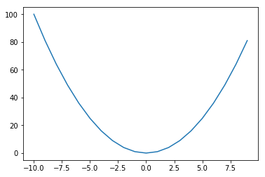
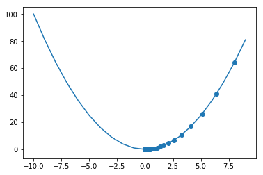
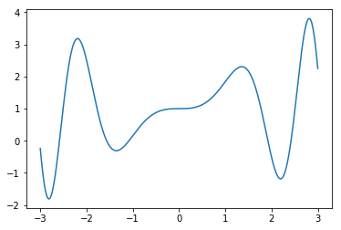
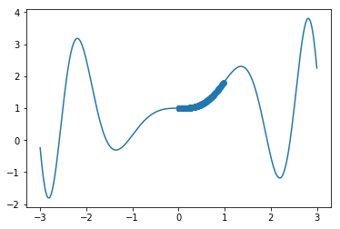

Chapter 7<br/>
< Gradient Descent >
===============================

[[실행 코드]](https://github.com/alstn2468/Python_For_Machine_Learning/blob/master/Chapter.7/5/5.ipynb)

```python
import numpy as np
import matplotlib.pyplot as plt
```


```python
x = np.arange(-10, 10, 1)
f_x = x ** 2

plt.plot(x, f_x)
plt.show()
```





```python
x_new = 10
derivative = []
y = []
learng_rate = 0.1

for i in range(100) :
    old_value = x_new
    derivative.append(old_value - learng_rate * 2 * old_value)
    x_new = old_value - learng_rate * 2 * old_value
    y.append(x_new ** 2)
```


```python
plt.plot(x, f_x)
plt.scatter(derivative, y)
plt.show()
```





```python
def sin_function(x) :
    return x * np.sin(x ** 2) + 1

def derivitive_f(x) :
    return np.sin(x ** 2) + 2 * (x ** 2) * np.cos(x ** 2)
```


```python
x = np.arange(-3, 3, 0.001)
f_x = sin_function(x)
```


```python
plt.plot(x, f_x)
plt.show()
```





```python
derivitive_f(3)
```


    -15.988226228682427


```python
x_new = 1
derivative = []
y = []
learng_rate = 0.01

for i in range(10000) :
    old_value = x_new
    x_new = old_value - learng_rate * derivitive_f(old_value)
    derivative.append(x_new)
    y.append(sin_function(x_new))

plt.plot(x, f_x)
plt.scatter(derivative, y)
plt.show()
```



